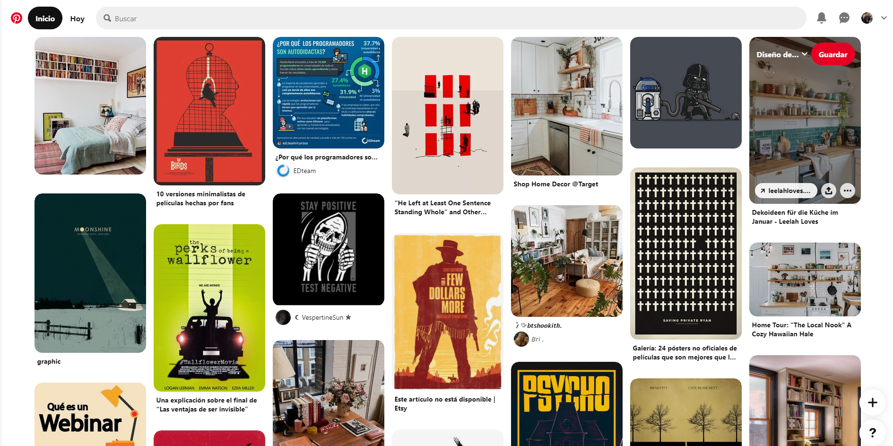
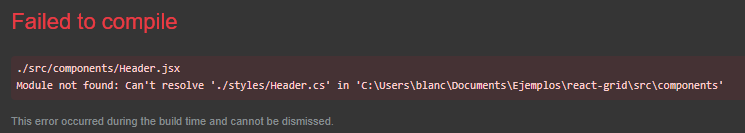
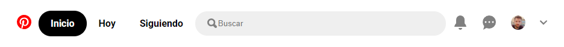
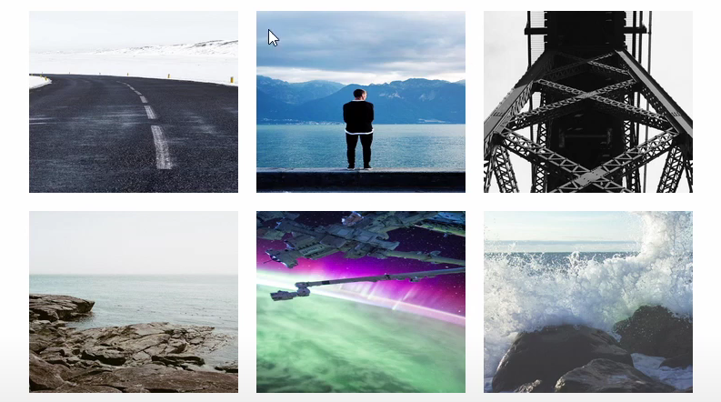
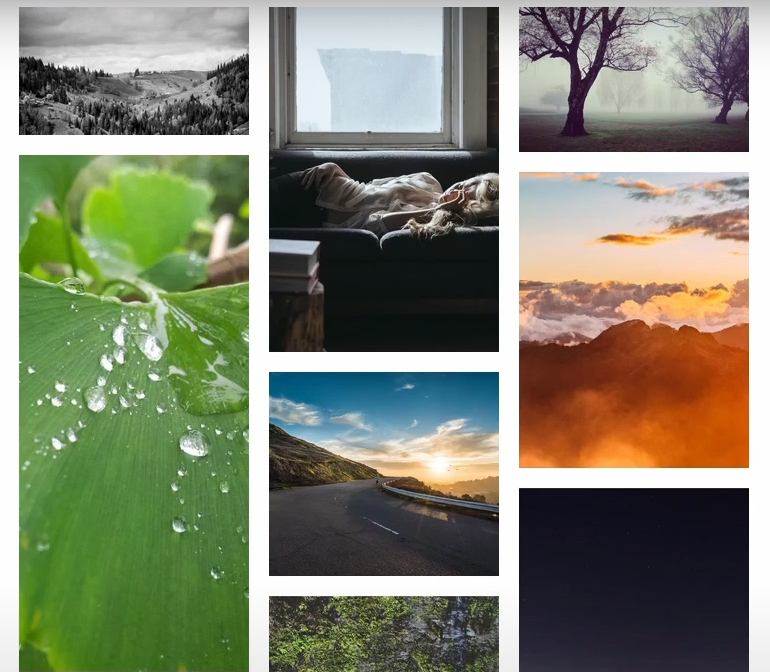

# Pinterest

<center><svg class="gUZ lZJ U9O kVc" height="160" width="160" fill='red' viewBox="0 0 24 24" aria-hidden="true" aria-label="" role="img"><path d="M0 12c0 5.123 3.211 9.497 7.73 11.218-.11-.937-.227-2.482.025-3.566.217-.932 1.401-5.938 1.401-5.938s-.357-.715-.357-1.774c0-1.66.962-2.9 2.161-2.9 1.02 0 1.512.765 1.512 1.682 0 1.025-.653 2.557-.99 3.978-.281 1.189.597 2.159 1.769 2.159 2.123 0 3.756-2.239 3.756-5.471 0-2.861-2.056-4.86-4.991-4.86-3.398 0-5.393 2.549-5.393 5.184 0 1.027.395 2.127.889 2.726a.36.36 0 0 1 .083.343c-.091.378-.293 1.189-.332 1.355-.053.218-.173.265-.4.159-1.492-.694-2.424-2.875-2.424-4.627 0-3.769 2.737-7.229 7.892-7.229 4.144 0 7.365 2.953 7.365 6.899 0 4.117-2.595 7.431-6.199 7.431-1.211 0-2.348-.63-2.738-1.373 0 0-.599 2.282-.744 2.84-.282 1.084-1.064 2.456-1.549 3.235C9.584 23.815 10.77 24 12 24c6.627 0 12-5.373 12-12S18.627 0 12 0 0 5.373 0 12"></path></svg></center>

# Introducción

Para esta actividad el desafío propuesto es construir un clon de [Pinterest](https://ar.pinterest.com/). En particular, implementar una replica de la galería de imágenes que se puede encontrar en la pagina de ‘inicio’ de cada usuario.



> Nota: Este ejemplo fue implementado con React. Se recomienda instalar todas las dependencias de la aplicación mediante el siguiente comando ejecutado en una terminal localizado en la carpeta del código fuente.
>
> ```
> npm install
> ```
>
> Para ejecutar la aplicación en modo de desarrollo, se debe ejecutar el siguiente comando
>
> ```
> npm start
> ```

# Guía Practica

# Resolución de errores y Debug

## Error sintáctico

Resuelve el primero de los errores que surgen al intentar ejecutar la aplicación.



## Error semántico

Puede pasar que aparezca algo así


Cuando en realidad, debería lucir así:



> Recurso para desarrolladores: Si queres maquetar sitios con usuarios, podes usar https://uifaces.co/ que nos regala de forma gratuita, fotos de perfil.

# Primer galería de imágenes con CSS Grid

Intenta obtener una galería parecida a esta. Podes usar el componente ‘Imagen’ que elige imágenes al azar.

> Nota: Ancho recomendado para las imágenes, 230px. Alto recomendado: 200px.

> Recursos para desarrolladores: Maquetar con imágenes es algo muy común hoy en día. Pero los clientes no siempre proveen las imágenes a tiempo. Por lo que podes usar https://picsum.photos/ para ir desarrollando el sitio.



> Ayuda: usa las funciones `repeat` y el valor `auto-fill` para crear grillas de forma automática.

# Segunda galería con CSS Grid

Pero nuestro objetivo. El efecto de Pinterest se lo suele denominar como efecto ‘masonry’ o de ‘ladrillos apilados’. Para lograr esto, podemos usar el componente `Columna` que genera columnas de imágenes independientes. Pero ojo!!! es necesario descomentar algunas líneas de código del componente `Imagen`



# Tercera galería con React-masonry-css

Pero esto aun tiene varios problemas. No termina de convencer, sobre todo cuando uno intenta cambiar el tamaño de la pantalla y el estilo termina por romperse. Para cumplir con el objetivo, vamos a usar una librería llamada `react-masonry-css` cuya documentación la podemos encontrar en https://www.npmjs.com/package/react-masonry-css

- Instala `react-masonry-css`
- Usa la librearía siguiendo las recomendaciones de su documentación.

# Toques finales

- Asegúrate de que las imágenes tenga un espacio entre ellas.
- Cuando el mouse se pose sobre las imágenes, las mismas se deben opacar.

Para estos dos puntos te recomiendo ver este [tutorial](https://www.youtube.com/watch?v=LnEimHQRfFQ&t=828s). Por último

- Cuando el mouse se pose sobre las imágenes, deben aparecer
  - El nombre de la imagen (cualquiera sea) en la parte superior.
  - Barra de botones inferiores típicos de Pinterest
